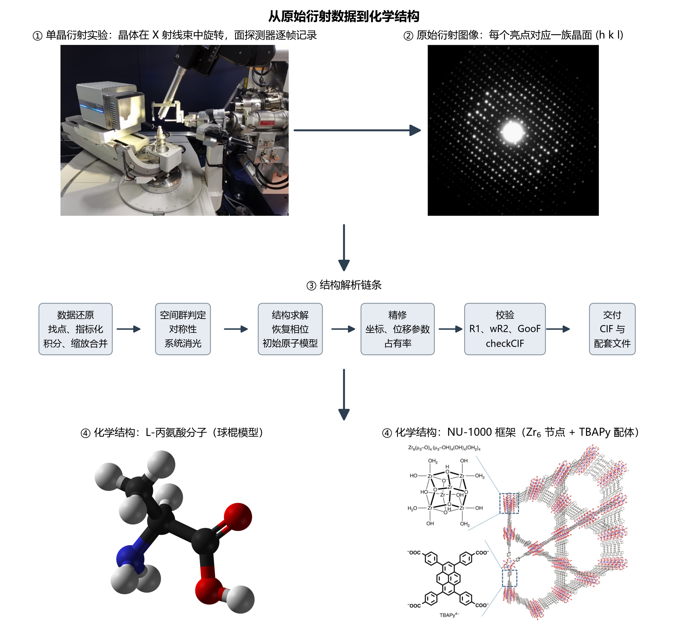
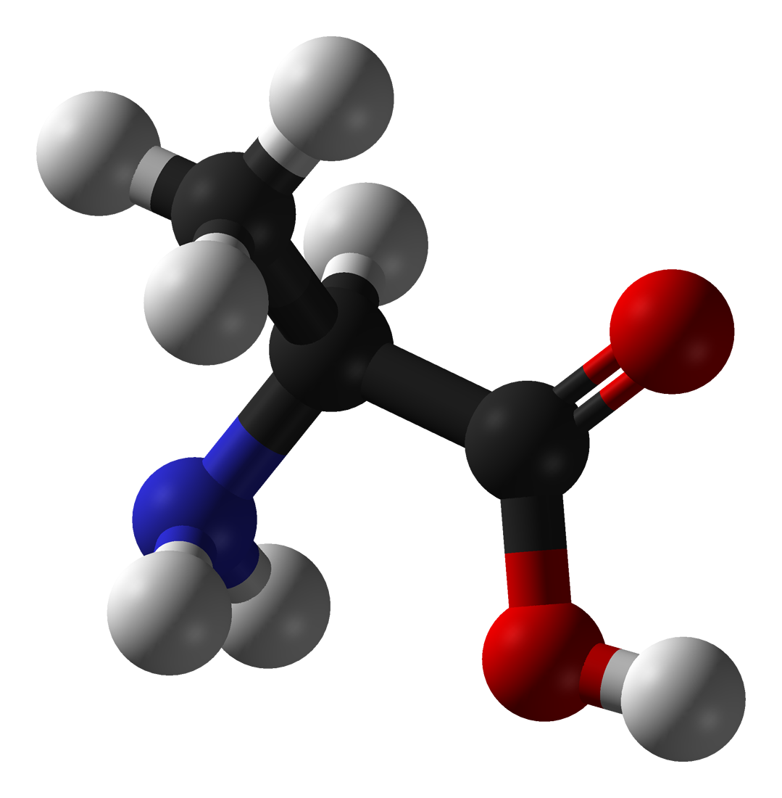
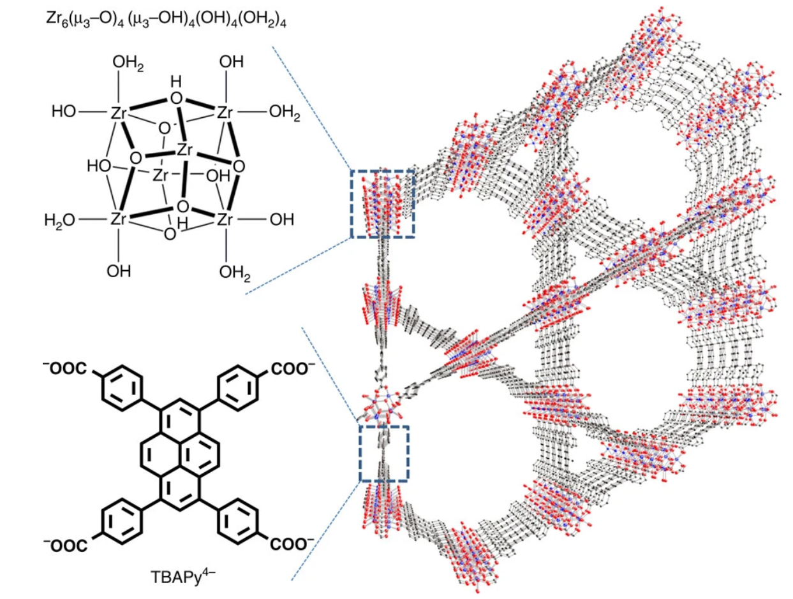
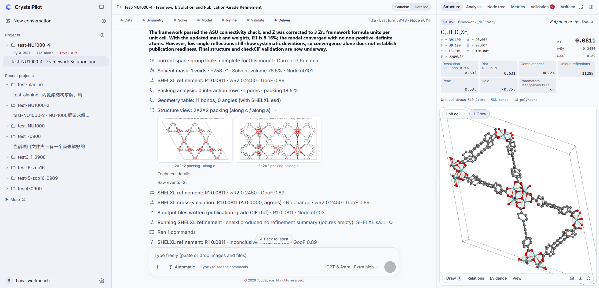
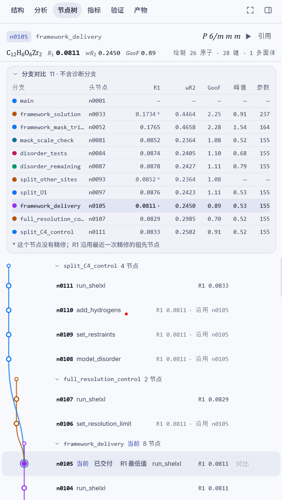
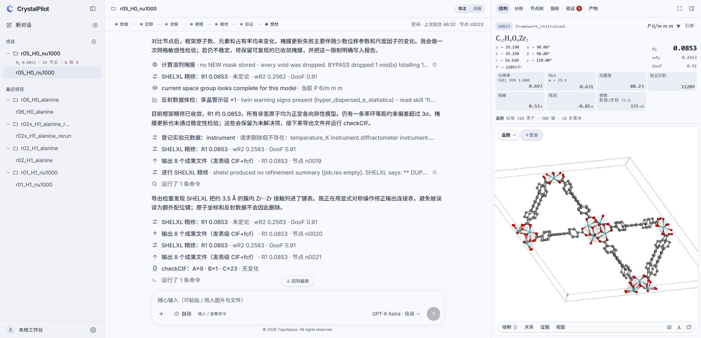

# CrystalPilot-TaskFullTest

通用编程 Agent 与晶体学 Agent 工作台 CrystalPilot 在单晶 X 射线衍射结构解析任务上的对照实验：两组真实数据、六个条件、十二轮无人值守运行的完整证据、独立复算与人工结构审核。

An English summary is at the end of this file.

| 项目 | 内容 |
|:---:|---|
| 目的 | 检验通用编程 Agent（Codex、Claude Code）直接执行单晶结构解析的能力，以及 CrystalPilot 提供的工具、状态、纪律与交互带来的变化 |
| 时间 | 2026 年 9 月 21 日 19:24 至 22 日 05:27（北京时间），十二轮串行 |
| 模型 | gpt-6-astra，全部条件同一模型 |
| 案例 | 丙氨酸原始衍射图像（646 帧）；锆基 MOF NU-1000 的反射数据 |
| 条件 | 纯 Codex、纯 Claude Code、Codex + CrystalPilot 环境、Claude Code + CrystalPilot 环境、CrystalPilot 纯工具、CrystalPilot 全功能 |
| 评价 | 独立程序复算 R1、本地 PLATON checkCIF、逐条命令审计、晶体学研究者的人工结构审核 |
| 干预 | 自动干预 0 次，人工科学干预 0 次 |
| 产品 | CrystalPilot 开发预览版　https://github.com/TopoSpace/CrystalPilot-Preview |

十二轮的事件流、Agent 的关键判断、交付结构的投影与复算结果汇总在 `运行事件记录.html`（离线页面，下载后用浏览器打开）；逐轮证据在 `runs/`，独立复算在 `verifier/`，目录说明见第 8 节。

---

## 摘要

本仓库记录的实验针对单晶 X 射线衍射结构解析这一任务：从一颗晶体的衍射数据出发，得到一个经过独立校验、可以发表和存档的化学结构。这一环节在化学与材料实验室中最依赖专家判断，目前最强的通用编程 Agent 直接执行得不到可用结果。TopoSpace 开发的晶体学 Agent 工作台 CrystalPilot 为模型提供类型化的晶体学工具、可分支回溯的节点状态、验证与交付纪律和研究者交互界面。为检验它的作用，实验用同一模型（GPT-6 Astra）在六个条件下处理两组真实数据（丙氨酸原始衍射帧、锆基 MOF NU-1000 的反射数据），共十二轮无人值守运行：纯 Codex 与纯 Claude Code（不给任何晶体学软件）；Codex 与 Claude Code 加 CrystalPilot 的软件环境；CrystalPilot 纯工具模式与全功能模式。每轮交付都经过独立程序复算、PLATON checkCIF 校验、逐条命令审计和晶体学研究者的人工结构审核。

结果分三层。纯 Codex/Claude Code 能自行写出整套算法并得到看似合格的 R 值，但四个结构都存在指标与警报反映不出的结构错误，不可用。加上软件环境之后，结构没有大错，但 Agent 为改善指标开始修改原始数据记录，把探测器阴影掩膜后重新积分。CrystalPilot 查到同一处阴影后保留数据并按诊断交付，结构解析与数据处理达到与人类专家一致、在数据诚实上更优的水平，全过程的每个节点、指标变化和警报都在界面上可见、可引用。CrystalPilot 的两轮交付都带 INS/RES/HKL/FCF/FAB 配对文件、逐条 checkCIF 警报解释和总结，独立复算与自报值一致；它在丙氨酸上保留探测器阴影的像素证据并按诊断交付，在 NU-1000 上用删除回峰检验否决孔道原子模型、用独立分支比较约束与无约束精修，这些判断与晶体学专家的处置一致。效率上 CrystalPilot 的优势明显：两个条件平均每轮用时 36 至 38 分钟、工具调用 84 至 126 次、输出 token 3.1 万至 3.8 万；输出 token 为加软件环境的原生 Agent 的 46% 至 58%，为纯 Codex/Claude Code 的 33% 至 48%。同一模型在 CrystalPilot 中用更少的时间和生成量，得到了更严谨的结构和完整的过程记录。

---

## 1　任务：单晶 X 射线衍射结构解析

### 1.1　这项任务做什么

单晶 X 射线衍射（SC-XRD）是确定分子和材料原子级三维结构的标准方法。把一颗尺寸在几十到几百微米的晶体固定在四圆衍射仪的测角头上，在 X 射线束中按设定的角度步进旋转，面探测器记录每个角度位置上的衍射图像。一次完整采集得到几百到几千张图像，每张图像上的亮点是晶体中一族晶面对 X 射线的相干散射，由三个整数指标 (h k l) 标记，亮度与晶胞内电子密度的傅里叶分量模平方成正比。图 1 给出从实验到化学结构的全过程。



链条上的六个环节各有明确的输入与输出：

| 环节 | 做什么 | 输出 |
|:---:|---|---|
| 数据还原 | 在图像上找衍射点，确定晶胞与取向（指标化），对每个衍射点积分强度，对不同角度和时间的测量做缩放与合并 | 反射数据（HKL）：每个 (h k l) 的强度与误差 |
| 空间群判定 | 根据晶胞对称性和系统消光确定晶体所属的空间群 | 空间群与对称操作 |
| 结构求解 | 衍射实验只记录强度，不记录相位；用直接法、电荷翻转或 Patterson 方法恢复相位，得到初始原子位置 | 初始原子模型 |
| 精修 | 用最小二乘法调整原子坐标、位移参数和占有率，使模型计算的结构因子与观测值一致；处理无序、溶剂、氢原子 | 收敛的结构模型 |
| 校验 | 计算一致性因子 R1、wR2、拟合优度 GooF 和残余电子密度，运行 IUCr 的 checkCIF 检查几何、位移参数、数据完整度等数十项并给出 A、B、C 级警报 | 校验报告 |
| 交付 | 把模型、反射数据、精修记录和实验元数据写成晶体学信息文件（CIF），供期刊审稿与结构数据库存档 | CIF 与配套文件 |

最终交付物是 CIF。它是期刊和剑桥结构数据库接受结构的唯一格式，其中每个原子的坐标、位移参数和每条精修约束都要经得起 checkCIF 与审稿人的检查。衡量一个结构的核心指标是 R1（观测与计算结构因子的一致性，小分子结构发表水平为 0.05 以下，多孔框架材料为 0.10 以下）、wR2、GooF、残余电子密度峰谷，以及 checkCIF 的 A 级警报数。

实验用两例真实数据代表这项任务的两端。L-丙氨酸（图 2）是最小的手性氨基酸，晶体属正交晶系 P2₁2₁2₁，晶胞 5.79 × 5.97 × 12.30 Å，不对称单元 6 个非氢原子、7 个氢原子。它的难点在链条长：本例从 646 张原始衍射图像开始，还原、定群、求解、精修、校验每一步的参数都由 Agent 自己决定。NU-1000（图 3）是锆基金属有机框架，由 Zr₆ 氧簇节点与 1,3,6,8-四(对苯甲酸基)芘（TBAPy）配体连成六方晶系 P6/mmm 的三维框架，a = 39.19 Å，c = 16.61 Å，晶胞体积 22 093 ų，六方大孔直径 31 Å。它的难点在判断：孔道里未建模的溶剂散射压低所有拟合统计，弱的高角数据限定不住轻原子几何，起始模型除晶胞和对称操作外什么都没有，金属种类只能从一张合成条件截图里读出来。





### 1.2　为什么这项任务对大模型困难

这项任务同时具备五个特征，每一个都超出了通用编程 Agent 的现有能力。

1. **链条长，错误静默传播。** 从图像到 CIF 有六个环节、几十个参数选择。一个错误的分辩率截断、一个漏掉的吸收校正、一个错判的空间群，不会在当下报错，会在两三步之后以变差的统计量出现，而那时的直接原因看起来像模型问题。
2. **关键环节依赖判断。** 数据的问题（探测器阴影、孪晶、吸收）无法靠改模型弥补；模型的改动（分裂位点、加约束、掩膜溶剂）必须有电子密度证据；结构何时定稿、何时只能作为诊断结果交付，由研究者的经验决定。
3. **指标好看的结构未必正确。** 删掉不符合的反射、掩膜更多的电子密度、给模型加更多参数，都会降低 R1。化学上错误的结构可以有漂亮的 R 值和干净的 checkCIF 报告，所以评价一个结构最终要由人打开 CIF 检查。
4. **要操作多套专业软件。** 数据还原用 DIALS 或厂商软件，求解用 SHELXT，精修用 SHELXL，校验用 PLATON，可视化用 Olex2。每套程序有自己的输入格式、指令卡和失败方式，彼此之间靠研究者手工衔接。
5. **缺少自检手段。** 模型自己无法判断输出是否正确，只有独立复算、checkCIF 与专家的结构审读才能给出结论。

原生的 Codex 与 Claude Code 是通用编程 Agent，没有晶体学工作流和上述工具，也没有把几十个中间模型组织成可回溯状态的机制和相应的领域纪律。直接把它们放到一台工作站上处理衍射数据，它们只能临时编写整套算法，或者在机器上寻找现成程序并摸索用法。第 4、5 节的实测给出了这两种做法各自的结果。

### 1.3　稳定实现的意义与商业价值

单晶结构是化学的最终证据。合成化学家做出一个新化合物，唯一能确证其连接方式、构型和堆积的方法就是单晶衍射；剑桥结构数据库已收录 130 万个以上的小分子晶体结构，每年新增 5 万个以上。药物研发中，每个小分子药物的手性构型确认、晶型与盐型筛选、共晶专利都以单晶结构为依据；金属有机框架、共价有机框架等多孔材料的发现速度直接受结构解析速度限制。

目前的瓶颈是专家时间。全球在役的单晶衍射仪数以千计，每台价格数百万元人民币，一次采集需要几十分钟到几小时；把数据变成可发表结构需要一位有经验的晶体学家工作数小时到数天。多数合成课题组没有专职晶体学家，结构解析常常排队数天到数周，无序、孪晶、溶剂散射这类问题要送到外部专家处理。

一个稳定的结构解析 Agent 相当于为每台衍射仪配备一名随时可用的结构解析人员：合成化学家早上放上晶体，当天拿到经过 checkCIF 的结构和一份写明未决问题的说明，合成与结构之间的反馈周期从一周缩短到一天；正在建设的自驱动实验室也需要这一环把表征数据变成化学结论。商业形态包括面向课题组和企业研发部门的软件订阅、与衍射仪厂商采集软件的集成、结构服务中心的产能扩张，以及结构数据库的质量控制。

---

## 2　Harness：CrystalPilot

### 2.1　设计原则

CrystalPilot 是 TopoSpace 开发、已在实际结构解析中使用的单晶结构解析 Agent 工作台，开发预览版公开在 https://github.com/TopoSpace/CrystalPilot-Preview 。它让模型在结构解析中承担研究者的判断，把调用程序、衔接格式、记录状态、复算指标这些重复性工作做成基础设施，为模型补上通用 Agent 缺少的四层。

| 层 | 提供什么 | 解决第 1.2 节的哪个困难 |
|:---:|---|---|
| 工具层 | 77 个类型化的晶体学工具：原始帧导入与 DIALS 还原、反射数据审计、空间群筛查、SHELXT 求解、SHELXL 精修、差值图读峰、溶剂掩膜、几何与无序检查、checkCIF 等。每个工具定义参数、失败返回和结果来源，结果附带指标变化 | 多套软件的操作与衔接 |
| 状态层 | 每一步计算写入一个可分支、可回溯的节点；节点带 R1、wR2、GooF、残峰、参数数；分支之间可以对比，任意节点可以检出继续 | 长链条中的错误定位与回退 |
| 纪律层 | 工具内校验（零周期复算、几何检查）、诚实的工具状态（无变化、未定论、证据相反、超时）、交付契约（结构文件配对、逐条警报解释、未决问题清单）；全功能模式另有 26 张以 markdown 存放的专家经验卡片，模型可读可写 | 判断与停止；指标与真实的区分 |
| 交互层 | 网页工作台：节点树与分支对比表、指标趋势、验证页签、结构视图；研究者可选中原子、测量、点击残峰或警报把它们“引用”进对话，可带图提问、插话或停止 | 人机协同与审核 |

### 2.2　研究者看到的工作台

工作台左栏是项目与节点树，中栏是对话与过程，右栏是结构视图、指标与验证。中栏每次工具调用一行，展开可见参数、结果和节点变化；回合收束行显示用时、节点范围、R1 变化和工具次数；SHELXT 等长作业在后台运行时有实时状态行。右栏的结构卡显示当前节点的空间群、R1/wR2/GooF、分辩率、Rint、完整度、残峰和 Flack 参数；节点树给出每个分支的指标对比与“当前、已交付、R1 最低”标记；验证页签把 checkCIF 的 A/B/C/G 警报逐条列出并附含义。下面四张截图取自产品文档，说明界面构成。






### 2.3　为本次实验新增的工程

以下工程只服务于实验测试，不改变产品的科学行为：把引擎按提交 `327e1ef` 导出为冻结副本并另起一个服务实例；为原生 Codex、CrystalPilot、Claude Code 各建一套只在实验目录内生效的运行时配置；输入封存与泄漏排查（丙氨酸目录中 206 个携带还原结果或数据库检索结果的文件被排除并逐个记录理由）；全功能模式知识快照中与 NU-1000 直接相关的三处内容去标识；无人值守运行器（硬时限、固定模板干预、事件流落盘、封存）；独立复算与评分脚本；纯 Codex/Claude Code 条件的隔离 Python 环境；纯 Codex/Claude Code 交付物的 CIF 到 SHELXL 复算链路。全部脚本、冻结计划、逐轮证据与复算输出都在本仓库（第 8 节）。

---

## 3　实验设计

### 3.1　两个案例

| 案例 | 输入 | 化学与对称性 | 难点 | 预算 |
|:---:|---|---|---|:---:|
| 丙氨酸 | 646 张原始衍射图像（Rigaku HyPix-Arc 探测器，Mo Kα）及采集元数据，110 MB；样品化学式 C₃H₇NO₂ | L-丙氨酸，P2₁2₁2₁，6 个非氢原子 | 从图像开始的完整链条；采集中存在探测器阴影 | 120 分钟 |
| NU-1000 | 反射数据 start.hkl（337 815 条反射，波长 0.68883 Å）、起始文件 start.ins（只有晶胞、P6/mmm 对称操作、SFAC C H N O 和四个占位原子）、一张合成条件截图 | Zr₆ 节点 + TBAPy 配体，P6/mmm，V = 22 093 ų | 大晶胞高对称框架；孔道溶剂散射；弱高角数据；金属种类只在截图中 | 180 分钟 |

### 3.2　六个条件

| 条件 | 内核 | 给了什么 |
|:---:|---|---|
| 纯 Codex | codex exec 0.155.0（与 CrystalPilot 同一二进制），无 MCP | 一个只含 numpy、scipy、matplotlib、pandas、pillow 的 Python 3.12 和 Windows 自带命令；消息前置禁令：不使用任何晶体学软件或程序库（SHELX、Olex2、PLATON、DIALS、XDS、CrysAlisPro、cctbx、gemmi、pymatgen、ASE、spglib、CrystalPilot 等），不下载安装，一切算法自行编写 |
| 纯 Claude Code | claude 2.1.261，无 MCP | 同上 |
| Codex + CrystalPilot 环境 | codex exec 0.155.0，无 MCP | environment.json 列出 CrystalPilot 自带的 SHELXT、SHELXL、PLATON、Olex2、DIALS 3.30 的路径与用法提示；不给工具、状态、知识、界面 |
| Claude Code + CrystalPilot 环境 | claude 2.1.261，无 MCP | 同上 |
| CrystalPilot 纯工具 | CrystalPilot 工作台，knowledge_mode = tools_only | 73 个专业工具、节点库、工具内校验、交付流程；没有 skill 工具和知识卡片 |
| CrystalPilot 全功能 | CrystalPilot 工作台，knowledge_mode = full | 比纯工具多四个 skill 工具和去标识后的 26 张知识卡片；完整产品 |

六个条件使用同一模型 gpt-6-astra。Codex 内核与 CrystalPilot 的推理档位为 xhigh；Claude Code 通过同一网关的 Anthropic 兼容接口调用同一模型。

### 3.3　任务提示

每个条件在每一例上收到相同的任务材料：一份 environment.json（预算、目录、规则；带软件的条件另有软件路径，纯 Codex/Claude Code 条件另有 Python 环境说明）、一段各组共同的运行约定、一句短任务提示。丙氨酸的提示是：

> 请用 inputs/alanine/ 中的丙氨酸单晶原始衍射数据，尝试完成结构解析与精修，得到接近发表质量的结构。请保留可复现的结构文件和计算记录，并说明目前仍未解决的问题。

NU-1000 的提示在此基础上指明三个输入文件并附范围句。纯 Codex/Claude Code 条件的消息最前面多一段禁令，原文见 `freeze/plan_pure.json`。同一案例下带软件的四个条件收到的提示完全相同，两个纯 Codex/Claude Code 条件收到的提示完全相同；提示原文在 `freeze/prompts/`。

任务提示保持简短，与研究者向助手交代任务的方式一致：说明数据在哪里、要什么结果、要求报告未决问题。处理流程的细节属于被测 Harness 的一部分，不写进提示。

### 3.4　运行规则

每轮丙氨酸 120 分钟、NU-1000 180 分钟，从科学任务发出时计时。带软件的八轮在 2026 年 9 月 21 日 19:22 冻结计划后按种子 20260921 生成的顺序串行运行；纯 Codex/Claude Code 四轮在看到八轮结果后追加，提示词于 22 日 02:05 确认后冻结，01:58 至 05:27 串行运行。每次只跑一个重任务。总控只做确定性的环境管理：审批请求一律拒绝并记录；Agent 向人提问时给一次固定回复；NU-1000 若问孔道客体是否要处理则重复一次范围句；后台作业结束而 Agent 空闲时发一次固定通知。十二轮中这些固定回复一次都没有触发，没有任何一轮得到人工的科学提示。为纯 Codex/Claude Code 条件预注册了提前停止规则（30 分钟仍未读入数据且无算法代码即停），也没有触发。

### 3.5　隔离与审计

三套运行时配置互不共享状态，不触碰本机上正在使用的 Codex、Claude Code 和 CrystalPilot 生产实例。同一个 Windows 用户下无法用权限拒绝参试进程读取其他目录，隔离靠三重手段：提示中明令只读 inputs、不访问其他目录；原生内核以最小化环境变量启动，纯 Codex/Claude Code 条件的 PATH 只含指定 Python 与系统目录，PYTHONNOUSERSITE=1；所有命令与文件访问事后逐条审计。纯 Codex/Claude Code 四轮的审计结果：232 条壳命令与 237 次文件工具调用中，没有调用任何晶体学程序或库，没有其他解释器，没有下载安装，没有读取工作目录之外的文件。NU-1000 是 CrystalPilot 的开发案例之一；本次的内核目录从零开始，引擎副本删除了全部开发文档，知识快照中与该案例直接相关的三处内容已改写。

### 3.6　三层评价

**第一层，自动复算与校验。** 解析每轮交付的 CIF、RES、HKL；用同一版本的 SHELXL 在交付的反射集合上以零周期复算最终模型的 R1，预注册容差 1e-4；纯 Codex/Claude Code 四轮没有 SHELX 文件，把 CIF 中的模型（晶胞、对称操作、坐标、占有率、位移参数）和交付的反射文件转成 SHELXL 作业，固定全部原子只精修标度后复算，特殊位置占有率按位点对称阶数折算，按波长补 Zr 的反常散射项，方法在对照模型上验证与零周期值一致；本地 PLATON checkCIF，A 级警报分为元数据类与实质类；从最后一段说明抽取 R1 声明、空间群和是否宣称完成；按预注册评分表给出分数区间。

**第二层，过程审计。** 每轮的原生事件流、工具调用、命令、文件访问、自动干预与用量全部落盘并封存。

**第三层，人工结构审核。** 一位晶体学研究者在自动评价完成后逐个打开十二个交付的 CIF 及其配套文件，检查结构是否正确、数据处理是否严谨、结果是否可用。这一层是本实验结论的依据：有一类结构错误在 R 值和 checkCIF 警报上不表现，只能由人看结构发现。自动指标全部保留，与人工审核并列。

---

## 4　结果

### 4.1　自动评价

表中十二轮按案例与条件排列。加粗为同一案例四个带软件条件中的最优值，下划线为次优值；纯 Codex 与纯 Claude Code 两行的结构经人工审核存在结构错误，其指标不参与最优与次优的标记。R1 独立复算：带 SHELX 文件的轮次为 RES 零周期，纯 Codex/Claude Code 轮次为 CIF 模型转 SHELXL 只精修标度。GooF 以接近 1 为优。checkCIF A 列括号内为剔除元数据类后的实质警报数。

**表 1　结构质量**

| 轮 | 条件 | 案例 | R1 报告 | R1 复算 | wR2 | GooF | 分辩率 Å | 完整度 | 精修反射 | checkCIF A（实质）/B/C | 科学状态 |
|---|---|:---:|:---:|:---:|:---:|:---:|:---:|:---:|:---:|:---:|:---:|
| r10 | 纯 Codex | NU-1000 | 0.1965 | 0.1962 | 0.504 | 1.742 | 全数据 | 未记录 | 11289 | 22（16）/7/12 | 诊断交付 |
| r09 | 纯 Claude Code | NU-1000 | 0.1750 | 0.1785 | 0.463 | 2.513 | 1.00 | 未记录 | 4395 | 21（15）/5/12 | 诊断交付 |
| r04 | Codex + CrystalPilot 环境 | NU-1000 | 0.0827 | **0.0827** | 0.272 | **0.987** | **1.00** | 99.9% | 4395 | 10（3）/2/23 | 部分结果 |
| r07 | Claude Code + CrystalPilot 环境 | NU-1000 | 0.0876 | 0.0876 | 0.316 | <ins>1.021</ins> | 1.10 | 99.9% | 3345 | 9（**2**）/2/21 | 诊断交付 |
| r05 | CrystalPilot 纯工具 | NU-1000 | 0.0853 | 0.0853 | <ins>0.256</ins> | 0.913 | **1.00** | 99.9% | 4395 | 9（**2**）/1/23 | 诊断交付 |
| r01 | CrystalPilot 全功能 | NU-1000 | 0.0849 | <ins>0.0849</ins> | **0.253** | 0.912 | **1.00** | 99.9% | 4395 | 9（**2**）/1/20 | 诊断交付 |
| r11 | 纯 Codex | 丙氨酸 | 0.0326 | 0.0326 | 0.075 | 1.311 | 0.75 | 97.0% | 623 | 3（2）/3/9 | 诊断交付 |
| r12 | 纯 Claude Code | 丙氨酸 | 0.0334 | 0.0335 | 0.076 | 1.329 | 0.71 | 86.3% | 657 | 7（3）/3/3 | 部分结果 |
| r03 | Codex + CrystalPilot 环境 | 丙氨酸 | 0.0304 | <ins>0.0304</ins> | **0.073** | **1.075** | <ins>0.76</ins> | <ins>99.2%</ins> | 984 | 1（**0**）/0/4 | 候选检查通过 |
| r08 | Claude Code + CrystalPilot 环境 | 丙氨酸 | 0.0302 | **0.0302** | **0.073** | <ins>1.095</ins> | 0.77 | **99.8%** | 964 | 3（**0**）/0/3 | 候选检查通过 |
| r06 | CrystalPilot 纯工具 | 丙氨酸 | 0.0457 | 0.0452 | 0.205 | 1.271 | **0.71** | 87.9% | 1055 | 4（1）/3/20 | 诊断交付 |
| r02 | CrystalPilot 全功能 | 丙氨酸 | 0.0442 | <ins>0.0437</ins> | <ins>0.200</ins> | 1.222 | **0.71** | 87.9% | 1055 | 4（1）/3/19 | 诊断交付 |

NU-1000 的六轮都从同一份反射数据出发，四个带软件条件的完整度相同（99.9%）。纯 Codex/Claude Code 两轮交付的 CIF 没有记录完整度与分辩率截断（r10 使用全部 11 289 个独立反射，r09 截至 1.0 Å）。丙氨酸的 r03 与 r08 完整度高于 CrystalPilot 两轮的原因见第 5.2 节。

**表 2　过程、用量与自我判断**

分数区间为预注册评分表的已确认下界至上界，其中“处理链可执行”与“结构文件配对”两项按 DIALS 输出与 SHELX 文件打分，纯 Codex/Claude Code 条件必然失分。加粗与下划线规则同表 1，分数区间按下界比较。

| 轮 | 条件 | 案例 | 分数区间 | 工具调用 | 用时 min | 输出 token | 宣称完成 | 列出未解决问题 |
|---|---|:---:|:---:|:---:|:---:|:---:|:---:|:---:|
| r10 | 纯 Codex | NU-1000 | 52.5 至 77.5 | 63 | 39.7 | 75,656 | 否 | 是 |
| r09 | 纯 Claude Code | NU-1000 | 52.5 至 77.5 | 159 | 63.0 | 100,840 | 否 | 是 |
| r04 | Codex + CrystalPilot 环境 | NU-1000 | 62.5 至 87.5 | 174 | 47.5 | 75,887 | 否 | 否 |
| r07 | Claude Code + CrystalPilot 环境 | NU-1000 | <ins>67.5 至 92.5</ins> | 178 | **45.3** | 64,707 | 是 | 是 |
| r05 | CrystalPilot 纯工具 | NU-1000 | **70.0 至 95.0** | **93** | <ins>46.5</ins> | **33,369** | 是 | 是 |
| r01 | CrystalPilot 全功能 | NU-1000 | **70.0 至 95.0** | <ins>140</ins> | 47.4 | <ins>47,629</ins> | 否 | 是 |
| r11 | 纯 Codex | 丙氨酸 | 57.5 至 77.5 | 96 | 54.4 | 84,009 | 否 | 是 |
| r12 | 纯 Claude Code | 丙氨酸 | 52.5 至 72.5 | 199 | 48.4 | 87,219 | 否 | 否 |
| r03 | Codex + CrystalPilot 环境 | 丙氨酸 | 67.5 至 92.5 | 187 | 42.3 | 57,426 | 否 | 是 |
| r08 | Claude Code + CrystalPilot 环境 | 丙氨酸 | 67.5 至 92.5 | 200 | 43.8 | 70,113 | 否 | 是 |
| r06 | CrystalPilot 纯工具 | 丙氨酸 | **70.0 至 90.0** | **74** | **25.7** | **27,661** | 是 | 是 |
| r02 | CrystalPilot 全功能 | 丙氨酸 | 67.5 至 87.5 | <ins>111</ins> | <ins>28.8</ins> | <ins>29,276</ins> | 否 | 是 |

**表 3　按条件汇总（两案例平均）**

| 条件 | 平均分数区间 | 平均用时 min | 平均工具调用 | 实质 A 警报合计 | 平均输出 token / 轮 |
|---|:---:|:---:|:---:|:---:|:---:|
| 纯 Codex | 55.0 至 77.5 | 47.0 | 80 | 18 | 79,833 |
| 纯 Claude Code | 52.5 至 75.0 | 55.7 | 179 | 18 | 94,030 |
| Codex + CrystalPilot 环境 | 65.0 至 90.0 | 44.9 | 180 | 3 | 66,657 |
| Claude Code + CrystalPilot 环境 | 67.5 至 92.5 | 44.5 | 189 | **2** | 67,410 |
| CrystalPilot 纯工具 | **70.0 至 92.5** | **36.1** | **84** | 3 | **30,515** |
| CrystalPilot 全功能 | <ins>68.8 至 91.2</ins> | <ins>38.1</ins> | <ins>126</ins> | 3 | <ins>38,453</ins> |

### 4.2　人工结构审核

审核对象是十二轮交付的主 CIF 及其反射文件、说明文件和过程记录。审核人为一位晶体学研究者。审核在自动评价完成后进行，逐个打开结构检查。

| 条件层 | 审核结论 |
|:---:|---|
| 纯 Codex、纯 Claude Code | 交付的结构不可用。四个 CIF 都存在结构上的错误，这些错误在 R 值和 checkCIF 警报上没有表现（丙氨酸两轮 R1 为 0.033，键长在常见范围内），只有打开结构逐项检视才能发现。数据处理是临时编写的近似算法，没有任何经过验证的晶体学程序参与；交付的 CIF 缺少存档所需的实验与精修信息。 |
| Codex + CrystalPilot 环境、Claude Code + CrystalPilot 环境 | 结构上没有大错。但 Agent 为了得到更好的指标，对原始数据做了不利于科学严谨的处理：丙氨酸一轮（r08）在发现低角强反射落在探测器阴影中后，自行定义探测器掩膜并重新积分，把阴影区从数据记录中抹去，没有把这一仪器问题报告出来留待处理；NU-1000 一轮（r04）的 CIF 缺少掩膜信息，另一轮（r07）没有完成 checkCIF。这类操作让指标变好，却让后续的数据分析失去了原始依据。 |
| CrystalPilot 纯工具、CrystalPilot 全功能 | 结构解析充分，数据处理没有为了指标而调整。丙氨酸两轮都查到了同一处探测器阴影，都保留原始数据与像素证据、拒绝删点或掩盖，并把结果按诊断交付封存；NU-1000 两轮在掩膜收敛性、电子数是否可信、几何是否需要约束上的判断与人类专家一致。数据解析程度与真实性达到与人类专家一致的水平，在数据处理的诚实上更优。全过程在界面上逐节点可见，每个节点的指标变化、每条警报、每个原子都可以引用和追问。 |

### 4.3　复算与审计结果

- 十二轮的 R1 都由独立程序复算：带 SHELX 文件的八轮差值不超过 0.0005；纯 Codex/Claude Code 四轮差值 0.0000 至 0.0035。四个自编精修引擎给出的 R1 都被独立程序证实，纯 Codex/Claude Code 的错误不在数值上，在结构上。
- 十二轮都运行了本地 checkCIF。带软件的八轮实质 A 级警报 0 至 3 条；纯 Codex/Claude Code 的 NU-1000 两轮 15、16 条，丙氨酸两轮 2、3 条，内容为 CIF 未嵌入反射数据、缺少位移/误差比、吸收系数、θ_full 等条目。
- 纯 Codex/Claude Code 四轮的命令逐条审计：无违规。
- 没有任何一轮把 R1 报错。十二轮里十轮在最终说明中列出了未解决问题；r04 与 r12 没有单列。三轮的说明含完成性表述（r05、r06、r07），其中 r07 同时承认 checkCIF 未完成。
- 自动干预与人工科学干预均为 0。封存记录显示十二轮的输入文件都没有被改动。

---

## 5　三层结果的解读

### 5.1　纯 Codex 与纯 Claude Code：自编算法的结果

两个原生产品在没有任何晶体学软件时都选择了自己编写算法。丙氨酸两轮从原始图像出发（各自报告解码了 616 帧），逆向推断出探测器的 TY6 差分压缩格式并写出解码器，枚举几何约定，联合拟合晶胞与探测器参数，做孔径积分和批次比例合并，分别用对称约束的电荷翻转（纯 Codex）和刚体分子的差分进化搜索（纯 Claude Code）求解，写含解析导数的各向异性最小二乘精修，代码量 2100 与 1300 行，用时 54 与 48 分钟。NU-1000 两轮读入 337 815 条反射并合并，从 Patterson 图定位 Zr，用差值 Fourier 补出配体；纯 Claude Code 把结果描述为 3 个 Zr₆ 节点与 6 个 C₄₄O₈ 配体组成的三维网络，纯 Codex 对全部 11 289 个独立反射做了精修。

这些工作在算法层面完整，结果不可用。人工审核在四个 CIF 中都发现结构上的错误，这些错误既不反映在 R1 上（丙氨酸 0.0326 与 0.0335，复算一致），也不反映在 checkCIF 警报上；NU-1000 两轮没有孔道处理，wR2 0.46 与 0.50、GooF 2.5 与 1.7，本身已不成立。它们交付的 CIF 缺少存档必需的实验与精修信息，反射文件是自定义文本，没有任何经过验证的程序参与过计算。只靠临时代码得出、未经任何验证程序检验的结构不能进入科学记录。这是这项任务需要晶体学工作流与工作环境的原因。

### 5.2　加软件环境的 Codex 与 Claude Code：结构可用，数据记录被改动

有了 SHELX、PLATON、DIALS 之后，两个原生产品的结构没有大错：丙氨酸 R1 0.0304 与 0.0302，完整度 99% 以上；NU-1000 R1 0.083 与 0.088，与 CrystalPilot 同级。问题出在对数据的处理上。Claude Code 在丙氨酸上发现若干理论上很强的低角反射被积分为近零，回查原始像素后认定是束挡与支架阴影，随即“根据探测器坐标加入保守的遮挡掩膜后重新积分”。这一步把完整度从 88% 提到 99.8%、R1 降到 0.030，指标上是十二轮里最好的一轮。阴影区是采集环节的仪器问题，正确的做法是报告该问题，留待仪器端或研究者决定；Agent 自行划定掩膜边界并移除受影响的观测之后，事后的数据分析拿到的是被处理过的数据，原始问题被掩盖了。Codex 在 NU-1000 上采用了溶剂掩膜但 CIF 里没有掩膜信息（checkCIF PLAT609）；Claude Code 在 NU-1000 上把分辩率截到 1.1 Å，未完成 checkCIF；Codex 在丙氨酸上 PLATON 命令行运行失败后放弃了验证。这些做法的共同点是把指标放在数据纪律之前。

### 5.3　CrystalPilot：解析充分，数据未动，过程可见

CrystalPilot 的两个条件对同一处探测器阴影的处置如下。全功能模式的 Agent 在 20:21 定位到“同一等价反射有约 9500 计数的清晰斑点，却被缩放判为离群；接近零、误差很小的测量反而保留下来”，20:29 从采集设置中找到“原始采集明确启用了喷嘴和晶体支架阴影处理，而本次 DIALS 记录只有尺度及衰减校正”这一独立线索，随后“保存原始帧的对应像素证据，并在最终文件中明确标注：候选结构已收敛，但尚不具备发表级数据验证”。纯工具模式的 Agent 在 23:18 确认“一条异常 022 观测的预测位置附近，11×11 像素区域全部为零”，并写道“当前工具未提供像素掩膜重积分入口，我会将这一限制与误剔除的强观测一起列入交付问题，不用删点掩盖它”。两轮都以 R1 0.044 至 0.045、完整度 88% 交付，标为诊断结果。人工审核认定这是正确的处置：结构本身正确，数据未被改动，问题被完整记录并交给人。

NU-1000 上，CrystalPilot 的判断同样与专家一致。全功能模式在删除回峰检验后认定“孔道中的不少散射是真实的，但现有原子模型出现严重短接触、漂移和极大的 ADP，不能作为化学结构保留”，转而建纯框架分支再比较掩膜，末端氧的两个分裂试验被精修否决后回到单个位点模型；纯工具模式在掩膜后指出“更新掩膜时电子数明显变化且未收敛，这还不能作为定稿结果”，并在发现苯环键长 1.36 至 1.50 Å 不均衡后在独立分支加约束并与无约束结果比较。两轮的交付都带 INS/RES/HKL/FCF/FAB 配对、逐条警报解释和中文总结，独立复算与自报值完全一致。图 8 是 r05 运行中的工作台画面：中栏是 Agent 关于掩膜稳定性、约束和键表修正的判断与工具行，右栏是节点 n0023 的结构卡与框架视图。



过程可见性方面，原生产品的过程只存在于终端文本里；CrystalPilot 的每一步是一个节点（NU-1000 两轮 60 与 24 个节点，丙氨酸两轮 19 与 11 个），研究者在界面上能看到节点树、每个分支的 R1/wR2/GooF 与残峰、指标随节点的变化、每条 checkCIF 警报及其解释，能选中任何原子或警报把它引用进对话，能在回合中插话或停止。本实验的人工审核借助这些记录完成。

### 5.4　效率

CrystalPilot 在用时、工具调用和 token 消耗三项上都优于其余条件，其中输出 token 的差距最大。输出 token 是模型生成的推理、代码与文字，是每轮成本和时延的直接来源。

| 条件 | 平均用时 min | 平均工具调用 | 平均输出 token / 轮 | 输出 token 相对 CrystalPilot 纯工具 |
|---|:---:|:---:|:---:|:---:|
| 纯 Codex | 47.0 | 80 | 79,833 | 2.6 倍 |
| 纯 Claude Code | 55.7 | 179 | 94,030 | 3.1 倍 |
| Codex + CrystalPilot 环境 | 44.9 | 180 | 66,657 | 2.2 倍 |
| Claude Code + CrystalPilot 环境 | 44.5 | 189 | 67,410 | 2.2 倍 |
| CrystalPilot 纯工具 | **36.1** | **84** | **30,515** | 1 |
| CrystalPilot 全功能 | <ins>38.1</ins> | <ins>126</ins> | <ins>38,453</ins> | 1.3 倍 |

按案例看，NU-1000 上 CrystalPilot 两轮的输出 token 为 3.3 万与 4.8 万，其余四轮为 6.5 万至 10.1 万；丙氨酸上 CrystalPilot 两轮为 2.8 万与 2.9 万，其余四轮为 5.7 万至 8.7 万。差距来自三处：预制的类型化工具替代了大量壳命令和试错，一次调用完成一步计算并直接返回指标；工具结果带结构化的指标变化，模型不需要自己解析程序输出；交付流程固定，模型不需要编写校验与整理代码。纯 Codex/Claude Code 的输出 token 多为自编算法的代码，加软件环境的原生 Agent 则把大量输出用在拼装命令行、读取程序输出和自写辅助脚本上。同一模型、同一任务下，CrystalPilot 用不到一半的生成量得到了更严谨的结构与更完整的过程记录。

### 5.5　CrystalPilot 的优势小结

综合十二轮的自动评价、人工审核和过程记录，CrystalPilot 相对于其余四个条件的优势集中在六个方面。

- **判断质量与专家一致。** 丙氨酸上，两轮都从缩放统计的异常追到原始像素并确认探测器阴影，全功能轮次还在采集设置中找到独立佐证；NU-1000 上，用删除回峰检验否决孔道原子模型，用独立分支比较约束与无约束精修，对掩膜电子数是否可信作出保留判断。人工审核认定这些处置与晶体学专家一致。
- **数据纪律。** 两轮都拒绝为改善指标而删点、掩膜或改动原始数据记录，把问题连同像素证据写进交付说明，并把结果标为诊断交付；环境组在同一问题上选择了掩膜后重新积分。
- **交付完整。** 每轮交付都带 INS/RES/HKL/FCF/FAB 配对文件、逐条 checkCIF 警报解释、未决问题清单和总结；独立复算与自报 R1 的差值不超过 0.0005，四轮的实质 A 级警报为 1 至 2 条。
- **过程透明，可协同。** 每一步计算是一个可回溯的节点（四轮共 114 个节点），分支对比、指标变化、每条警报和每个原子都可以在界面上查看和引用；研究者可以在回合中插话、停止或检出任一节点继续。
- **效率。** 平均用时 36 至 38 分钟、每轮输出 token 3.1 万至 3.8 万，两项都优于其余全部条件；工具调用 84 至 126 次，少于加环境的原生 Agent（180 至 189 次）和纯 Claude Code（179 次）。输出 token 为加环境原生 Agent 的一半左右、纯 Codex/Claude Code 的三分之一左右。
- **两种知识模式结果接近。** 纯工具模式与全功能模式在两例上的 R1、警报数和处置方式相同，说明工具层、状态层与纪律层已经承担了主要作用；知识卡片可由模型读取和写回，为后续积累专家经验留出了入口。

---

## 6　失败分析与改进

每轮的事件位置与 Agent 原话见仓库根目录的 `运行事件记录.html`，这里给出关键结论。

| 条件层 | 失败模式 | 改进 |
|:---:|---|---|
| 纯 Codex/Claude Code | 没有经过验证的软件参与：算法能跑通、指标好看，结构错误无法被自己的检查发现，CIF 不完整 | 改进方向是提供晶体学工作流与工作环境，即 CrystalPilot 提供的内容 |
| 环境组 | 指标优先的数据处理：探测器阴影被自行掩膜后重积分（r08）；掩膜信息未写入 CIF（r04）；分辩率截断且未完成 checkCIF（r07）；PLATON 命令行失败后放弃验证（r03） | 缺少领域纪律与交付契约的约束，这两项由 CrystalPilot 的纪律层提供 |
| CrystalPilot | 工具覆盖面的两处短板：DIALS 封装没有像素掩膜与重积分入口，Agent 只能记录阴影问题，完整度停在 88%；NU-1000 掩膜收敛判据依赖 Agent 判断 | 增加一个需要研究者确认边界的掩膜工具，把处理决定留在人手里；把“电子数变化、迭代未收敛”做成显式指标 |
| 实验系统 | 运行器在一次重跑收尾时因线程忙碌标志的竞态多等 30 分钟；原生内核树的 CPU 上限从 r07 起才生效；纯 Codex/Claude Code 驱动首次启动未转发计划文件，四轮在 0 分钟内退出后重启，未消耗模型调用 | 三处均已修正，修正后的运行器与限核脚本在仓库的 tools/ 目录 |

---

## 7　实验边界

- 每个条件每例一轮，共十二轮；一次同条件的丙氨酸重跑（R1 0.0465，同样查到阴影并按诊断交付）不计入对比，其材料不在本仓库中。
- 一个模型（当前最强档），两个案例，都是数据顺利的样品；无序、孪晶、赝对称、超结构等更难的案例不在本次范围内。
- 人工审核由一位晶体学研究者完成，不设盲审与第二审核人；没有设置独立的人类专家对照组，“与人类专家一致”是审核人的专业判断。
- 纯 Codex/Claude Code 条件的隔离靠指令与事后审计实现，本机上的晶体学软件在磁盘上仍然存在；审计结果为无违规。
- 预注册评分表的两项对纯 Codex/Claude Code 条件结构性不利，其分数区间部分反映交付形式。

---

## 8　目录结构

```
README.md                 实验报告与仓库说明
PROTOCOL.md               运行规程全文
LICENSE-CODE              tools/ 的许可证（MIT）
LICENSE-DATA.md           文档、证据与数据的许可证（CC BY 4.0）
运行事件记录.html          十二轮事件流、关键判断、结构投影与复算结果的离线页面
docs/images/              README 插图与 r05 运行中的工作台截图
inputs/
  nu1000/                 start.hkl、start.ins、三个输入文件的哈希
  alanine/                原始图像目录的哈希清单；图像本体见 Release 附件
freeze/
  plan.json               带软件八轮的冻结计划
  plan_pure.json          纯 Codex/Claude Code 四轮的冻结计划（含禁令原文与提前停止规则）
  protocol_frozen.json    冻结时刻各文件的哈希
  prompts/                任务提示与共同运行约定
  tool_names_*.json       两种知识模式的工具名清单
  knowledge_snapshot_manifest.json
environment/              版本、模型、机器、科学软件；纯 Codex/Claude Code 条件的 Python 环境
provenance/               输入封存与排除清单；知识快照去标识记录
runs/<run_id>/
  prompt.txt              该轮收到的完整消息
  final_message.txt       Agent 的最后说明
  interventions.jsonl     自动干预记录
  usage.json              工具调用与 token 用量
  manifest.json           条件、模型、用时、退出原因、提示哈希
  seal_manifest.json      封存时参试目录全部文件的哈希；inputs_tampered
  raw_events/             原生事件流（工作台事件、codex 事件或 claude 流）
  commands/               命令记录
  effective_instructions/ 实际生效的指令文件（工作台条件）
  native_state/           节点索引、知识写入、MCP 日志（工作台条件）
  artifacts/              交付的结构文件、说明、节点库与自编代码（文本类型）
verifier/<run_id>/
  report.json             复算与评分报告
  recompute/              SHELXL 零周期复算作业与输出
  recompute_from_cif*/    CIF 转 SHELXL 复算（纯 Codex/Claude Code 四轮）
  checkcif/               PLATON checkCIF 输出
analysis/
  results.csv             逐轮结果表
  run_index.csv           每轮的证据路径与会话 ID
  comparison_tables.md    自动评价全表
  comparison_rows.json    表格数据
  structure_checks.json   交付 CIF 的键长与位移参数检查
  pure_audit.json         纯 Codex/Claude Code 四轮的命令审计
  node_counts.json        工作台条件的节点数
  summary.json            汇总
tools/                    运行器、总控、复算、审计、汇总脚本
```

运行编号中的条件代码：C0N 纯 Codex、P1N 纯 Claude Code、C0 Codex + 环境、P1 Claude Code + 环境、H0 CrystalPilot 纯工具、H1 CrystalPilot 全功能。

---

## 9　核验与复跑

**核验一轮的封存与复算**：`runs/<run_id>/seal_manifest.json` 记录了参试目录在封存时刻的全部文件哈希与 `inputs_tampered`（十二轮均为空）；`verifier/<run_id>/report.json` 记录了复算所用文件的哈希、SHELXL 与 PLATON 输出的位置。`verifier/<run_id>/recompute/` 中的 `.ins` 与交付的 `.hkl` 可用同版本 SHELXL 直接重跑。

**复跑一轮**需要：Windows；CrystalPilot 提交 `327e1ef` 的检出（含 `.venv` 与 `vendor`）；DIALS 3.30 conda 环境；SHELXL 2019/3、SHELXT 2018/2、PLATON；Codex 内核 0.155.0（随 CrystalPilot 提供）；Claude Code 2.1.261；一个 OpenAI Responses 兼容的模型网关及其凭据；纯 Codex/Claude Code 条件另需按 `environment/pure_baseline_environment.json` 建立的 Python 3.12 虚拟环境。第三方程序不随本仓库分发。

1. 按 `tools/run_trial.py` 顶部的路径说明建立实验根目录，配置引擎副本、三套隔离的内核目录与凭据钩子。
2. `python tools/stage_inputs.py` 封存输入；`python tools/freeze_plan.py --include-p1 yes` 冻结计划。
3. `python tools/run_trial.py --run-id r01_H1_nu1000` 运行一轮；纯 Codex/Claude Code 轮次加 `--plan freeze/plan_pure.json`。
4. `python tools/verify_run.py --run-id <run_id>` 独立复算；纯 Codex/Claude Code 轮次再运行 `python tools/recompute_from_cif.py --run-id <run_id>`。
5. `python tools/analyze.py`、`python tools/build_comparison.py`、`python tools/audit_pure.py`、`python tools/structure_checks.py` 汇总。

---

## 10　与 CrystalPilot 的关系

CrystalPilot 是 TopoSpace 开发的单晶结构解析 Agent 工作台：以 Codex app-server 为内核，通过 MCP 提供类型化的晶体学工具，把每步计算写入可分支回溯的节点库，交付时附带校验文件、逐条警报解释和说明。本实验使用其私有仓库提交 `327e1ef` 的冻结副本，产品本体不在本仓库中；公开预览见 https://github.com/TopoSpace/CrystalPilot-Preview 。本仓库中的文本已脱敏：模型网关地址、凭据与本机用户名已替换为占位符。

---

## 11　许可证

`tools/` 下的脚本采用 MIT 许可证（`LICENSE-CODE`）；文档、证据记录与数据采用 CC BY 4.0（`LICENSE-DATA.md`）。

---

## English summary

This repository holds the complete evidence of a controlled experiment on single-crystal X-ray structure determination, run on 21 and 22 September 2026. One model (gpt-6-astra) processed two real data sets, a raw-frame L-alanine collection (646 Rigaku HyPix frames) and the reflection data of the Zr-MOF NU-1000, under six conditions: bare Codex and bare Claude Code with no crystallographic software at all; Codex and Claude Code given the software environment assembled by CrystalPilot (SHELXT, SHELXL, PLATON, Olex2, DIALS); and the CrystalPilot workbench in its tools-only and full modes. Twelve unattended runs were sealed, re-computed with SHELXL by an independent script, checked with PLATON checkCIF, audited command by command, and finally inspected structure by structure by a crystallographer. The bare agents wrote their own decoders, integration and refinement code and reached plausible R factors, but the delivered structures contain errors that neither R1 nor checkCIF reveals and are unusable. Given the environment, the structures no longer had major errors, but the agents manipulated the data record for better statistics, masking detector-shadowed regions and re-integrating. CrystalPilot diagnosed the same shadow, refused to alter the data, delivered the result as diagnostic, and exposed every node, metric trajectory and alert for the human to cite and steer. Directory layout, verification and re-run instructions are given above; the protocol is in PROTOCOL.md.
